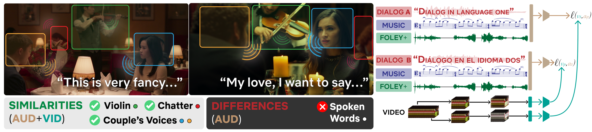

# Looking Similar Sounding Different: Leveraging Counterfactual Cross-Modal Pairs for Audiovisual Representation Learning
#### CVPR 2024



## Abstract
Audiovisual representation learning typically relies on the correspondence between sight and sound. However there are often multiple audio tracks that can correspond with a visual scene. Consider for example different conversations on the same crowded street. The effect of such counterfactual pairs on audiovisual representation learning has not been previously explored. To investigate this we use dubbed versions of movies and television shows to augment cross-modal contrastive learning. Our approach learns to represent alternate audio tracks differing only in speech similarly to the same video. Our results from a comprehensive set of experiments investigating different training strategies show this general approach improves performance on a range of downstream auditory and audiovisual tasks without majorly affecting linguistic task performance overall. These findings highlight the importance of considering speech variation when learning scene-level audiovisual correspondences and suggest that dubbed audio can be a useful augmentation technique for training audiovisual models toward more robust performance on diverse downstream tasks.

## Citation

If you find this work useful in your research, please cite our paper:

```bibtex
@inproceedings{singh2024looking,
  title={Looking similar sounding different: Leveraging counterfactual cross-modal pairs for audiovisual representation learning},
  author={Singh, Nikhil and Wu, Chih-Wei and Orife, Iroro and Kalayeh, Mahdi},
  booktitle={Proceedings of the IEEE/CVF Conference on Computer Vision and Pattern Recognition},
  pages={26907--26918},
  year={2024}
}
```

The methods and systems described in this work are the subject of the following patent application:

```bibtex
@misc{singh2024methods,
  title={Methods and systems for learning language-invariant audiovisual representations},
  author={Singh, Nihkil and Orife, Iroro and Wu, Chih-Wei and Kalayeh, Mahdi},
  year={2024},
  month=may # "~16",
  publisher={Google Patents},
  note={US Patent App. 18/505,081}
}
```

# Model Variants


| Model | # data | init. | (λ<sub>v</sub>, λ<sub>a</sub>) | avg. # dubs | dub augment | config |
|:-------------:|:-------------:|:-------------:|:-------------:|:-------------:|:-------------:|:-------------:|
| B.3 | 19.4M | rand. | (0.0, 0.0) | 0.6 | ❌ | [link](https://drive.google.com/file/d/1G7d0aWaBy6dZoqRivmVD4boZL8I6DFRh/view?usp=drive_link) |
| B.5 | 5.1M  | B.3   | (0.2, 0.2) | 2.8 | ✔️ | [link](https://drive.google.com/file/d/1ZJ5uhZD1MdZ968KqChEWf1rZA945NxL1/view?usp=drive_link) |
| C.2 | 5.1M  | C.1   | (0.1, 0.1) | 2.8 | ✔️ | [link](https://drive.google.com/file/d/1d0gl7HCpLeDQWn2QVyWZ_LJDJrVZerFB/view?usp=drive_link) |

You can obtain the model weights from [here](https://drive.google.com/drive/folders/1TQC1HKRQDd70m79dRStxy06GIDi_QaQT?usp=sharing).

# Setup
After installing `conda`, let's create a virtual environment

```bash
conda create -n lssd python==3.10.12
conda activate lssd
cd path/to/lssd
pip install -r requirements.txt
```


# Inference
Activate the virtual environment
```bash
conda activate lssd
```
We can now run inference from `gitroot` as follows
```bash
python src/inference.py
    --cfg path/to/config/file
    DATA.PATH_TO_DATA_DIR path/to/input/dir
    OUTPUT_DIR path/to/output/dir
```
The input directory could consist of nested subdirectories. The code will [read](src/datasets/dataset.py#L148) all the [eligible](src/datasets/dataset.py#L99) files. </br >Here is an example with toy data:
```bash
python src/inference.py
    --cfg pretrained_models/B/3/config.yaml
    DATA.PATH_TO_DATA_DIR sample_data
    OUTPUT_DIR tmp
```

Once inference finished, we use [postprocess](src/utils/utils.py#L68) helper function to read the embedidngs
```bash
from src.utils import utils
records = utils.postprocess(output_dir='tmp', mtype='video')
```

Now, let's randomly look into an element in the output
```bash
file_path, embedding = records[7]
file_path --> 'sample_data/ucf101/GolfSwing/v_GolfSwing_g02_c01.avi'
embedding --> tensor([[[-0.4841,  0.0313, -0.1657,  ...,  0.4615, -0.2974, -0.1896],
                [-0.3369,  0.0044, -0.2398,  ...,  0.6181, -0.2790, -0.1521],
                [-0.5053,  0.0215, -0.1337,  ...,  0.4141, -0.2636, -0.1665],
                [-0.3021, -0.0042, -0.2243,  ...,  0.5710, -0.2721, -0.1733],
                [-0.3883,  0.0167, -0.0674,  ...,  0.3980, -0.3411, -0.2996]],

                [[-0.2586,  0.1188, -0.2547,  ...,  0.1519, -0.1593, -0.0689],
                [-0.3787,  0.1304, -0.3470,  ...,  0.2081, -0.0380,  0.0979],
                [-0.1191,  0.1452, -0.1677,  ...,  0.1159, -0.1355, -0.1265],
                [-0.2803,  0.1562, -0.2639,  ...,  0.2145, -0.0079,  0.0265],
                [-0.3301,  0.0992, -0.1835,  ...,  0.1489, -0.0650, -0.0333]]])

```
We can examine the shape of the embedding via
```bash
embedding.shape --> torch.Size([2, 5, 768])
```
Video embeddings will be in `Mx5xD` shape (5 is due to [FiveCrop](src/datasets/build.py#L62)) while audio ones are in `MxD` shape, where `M` varies by the media asset runtime.
